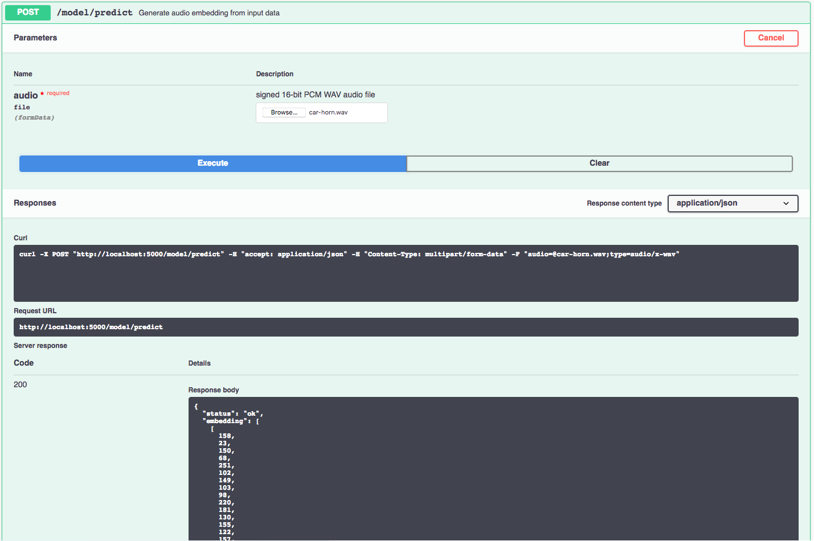

[](https://travis-ci.com/IBM/MAX-Audio-Embedding-Generator) [](http://max-audio-embedding-generator.max.us-south.containers.appdomain.cloud/)

[](http://ibm.biz/max-to-ibm-cloud-tutorial) 

# IBM Code Model Asset Exchange: Audio Embedding Generator

This repository contains code to instantiate and deploy an audio embedding model. This model recognizes a signed 16-bit
PCM wav file as an input, generates embeddings, applies
[PCA transformation/quantization](https://github.com/tensorflow/models/tree/master/research/audioset#output-embeddings),
and outputs the result as arrays of 1 second embeddings. The model was trained on
[AudioSet](https://research.google.com/audioset/). As described in the
[code](https://github.com/tensorflow/models/blob/master/research/audioset/vggish/vggish_inference_demo.py#L16) this model is
intended to be used an example and perhaps as a stepping stone for more complex models. See the
[Usage](https://github.com/tensorflow/models/tree/master/research/audioset#usage) heading in the `tensorflow/models`
Github page for more ideas about potential usages.

The model files are hosted on IBM Cloud Object Storage. The code in this repository deploys the model as a web service
in a Docker container. This repository was developed as part of the
[IBM Code Model Asset Exchange](https://developer.ibm.com/code/exchanges/models/) and the public API is powered by [IBM Cloud](https://ibm.biz/Bdz2XM).

## Model Metadata
| Domain | Application | Industry  | Framework | Training Data | Input Data Format |
| ------------- | --------  | -------- | --------- | --------- | -------------- |
| Audio | Embeddings | Multi | TensorFlow | Google AudioSet | signed 16-bit PCM WAV audio file|

## References

* _J. F. Gemmeke, D. P. Ellis, D. Freedman, A. Jansen, W. Lawrence, R. C. Moore, M. Plakal, and M. Ritter_, ["Audio set:
An ontology and human-labeled dataset for audio events"](https://static.googleusercontent.com/media/research.google.com/en//pubs/archive/45857.pdf),
in IEEE ICASSP, 2017.

* _S. Hershey, S. Chaudhuri, D. P. W. Ellis, J. F. Gemmeke, A. Jansen, R. C. Moore, M. Plakal, D. Platt, R. A. Saurous,
B. Seybold et  al._, ["CNN architectures for large-scale audio classification"](https://arxiv.org/pdf/1609.09430.pdf),
arXiv preprint arXiv:1609.09430, 2016.

## Licenses

| Component | License | Link  |
| ------------- | --------  | -------- |
| This repository | [Apache 2.0](https://www.apache.org/licenses/LICENSE-2.0) | [LICENSE](LICENSE) |
| Model Files | [Apache 2.0](https://github.com/tensorflow/models/blob/master/LICENSE) | [AudioSet](https://github.com/tensorflow/models/tree/master/research/audioset) |
| Model Code | [Apache 2.0](https://www.apache.org/licenses/LICENSE-2.0) | [AudioSet](https://github.com/tensorflow/models/tree/master/research/audioset) |
| Test samples | Various | [Sample README](samples/README.md) |


## Pre-requisites:

* `docker`: The [Docker](https://www.docker.com/) command-line interface. Follow the [installation instructions](https://docs.docker.com/install/) for your system.
* The minimum recommended resources for this model is 8 GB Memory and 4 CPUs.

# Steps

1. [Deploy from Docker Hub](#deploy-from-docker-hub)
2. [Deploy on Kubernetes](#deploy-on-kubernetes)
3. [Run Locally](#run-locally)

## Deploy from Docker Hub

To run the docker image, which automatically starts the model serving API, run:

```
$ docker run -it -p 5000:5000 codait/max-audio-embedding-generator
```

This will pull a pre-built image from Docker Hub (or use an existing image if already cached locally) and run it.
If you'd rather checkout and build the model locally you can follow the [run locally](#run-locally) steps below.

## Deploy on Kubernetes

You can also deploy the model on Kubernetes using the latest docker image on Docker Hub.

On your Kubernetes cluster, run the following commands:

```
$ kubectl apply -f https://raw.githubusercontent.com/IBM/MAX-Audio-Embedding-Generator/master/max-audio-embedding-generator.yaml
```

The model will be available internally at port `5000`, but can also be accessed externally through the `NodePort`.

A more elaborate tutorial on how to deploy this MAX model to production on [IBM Cloud](https://ibm.biz/Bdz2XM) can be found [here](http://ibm.biz/max-to-ibm-cloud-tutorial). 

## Run Locally

1. [Build the Model](#1-build-the-model)
2. [Deploy the Model](#2-deploy-the-model)
3. [Use the Model](#3-use-the-model)
4. [Run the Notebook](#4-run-the-notebook)
5. [Development](#5-development)
6. [Cleanup](#6-cleanup)

### 1. Build the Model

Clone this repository locally. In a terminal, run the following command:

```
$ git clone https://github.com/IBM/MAX-Audio-Embedding-Generator.git
```

Change directory into the repository base folder:

```
$ cd MAX-Audio-Embedding-Generator
```

To build the Docker image locally, run:

```
$ docker build -t max-audio-embedding-generator .
```

All required model assets will be downloaded during the build process. _Note_ that currently this Docker image is CPU
only (we will add support for GPU images later).


### 2. Deploy the Model

To run the Docker image, which automatically starts the model serving API, run:

```
$ docker run -it -p 5000:5000 max-audio-embedding-generator
```

### 3. Use the Model

The API server automatically generates an interactive Swagger documentation page. Go to `http://localhost:5000` to load
it. From there you can explore the API and also create test requests.

Use the `model/predict` endpoint to load a signed 16-bit PCM wav audio file (you can use the `car-horn.wav` file located
in the `samples` folder) and get embeddings from the API.



You can also test it on the command line, for example:

```
$ curl -F "audio=@samples/car-horn.wav" -XPOST http://localhost:5000/model/predict
```

You should see a JSON response like that below:

```
{
  "status": "ok",
  "embedding": [
    [
      158,
      23,
      150,
      ...
    ],
    ...,
    ...,
    [
      163,
      29,
      178,
      ...
    ]
  ]
}
```

### 4. Run the Notebook

Once the model server is running, you can see how to use it by walking through [the demo notebook](samples/demo.ipynb). _Note_ the demo requires `jupyter`, `numpy`, `sklearn` and `matplotlib`.

Run the following command from the model repo base folder, in a new terminal window (leaving the model server running in the other terminal window):

```
jupyter notebook
```

This will start the notebook server. You can open the demo notebook by clicking on `demo.ipynb`.

### 5. Development

To run the Flask API app in debug mode, edit `config.py` to set `DEBUG = True` under the application settings. You will
then need to rebuild the Docker image (see [step 1](#1-build-the-model)).

### 6. Cleanup

To stop the Docker container, type `CTRL` + `C` in your terminal.
